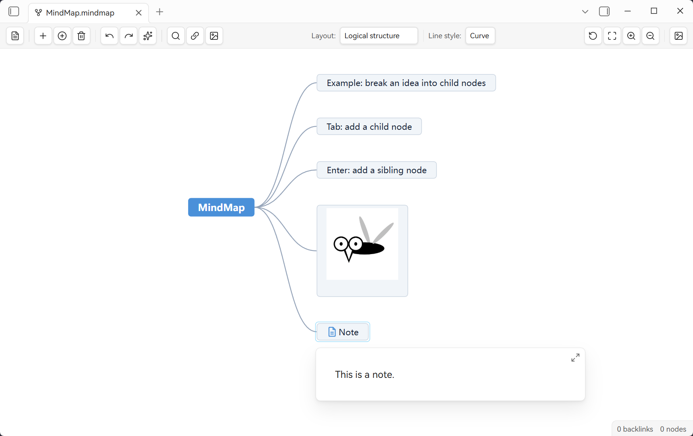

**English | [中文](README.zh-CN.md)**

<div align="center">

# 🧠 MindMap Studio

> Mind map rendering for Markdown inside Obsidian. Open `.mindmap.md` — a normal Markdown file — and edit it as a mind map; the Markdown outline round-trips losslessly. Powered by the [simple-mind-map](https://github.com/wanglin2/mind-map) engine, developed by [WinterMosquito](https://github.com/WinterMosquito).

<p align="center">
  
  
  
  
</p>

</div>

## 🚀 Quick start

1. **Create**: run **New mind map** (command palette or ribbon) — a `思维导图-YYYY-MM-DD.mindmap.md` file is created and opens as a mind map.
2. **Edit**: the file is ordinary Markdown, so its outline becomes the map — add/edit/delete nodes, drag to rearrange, attach images or links.
3. **Back & save**: use **Edit as Markdown** to return anytime; edits are written back to the file (layout & viewport live in the plugin's `data.json`).

---



## ✨ Why MindMap Studio

The plugin is a **rendering layer**, not a file-format converter. `.mindmap.md` files are 100% standard Markdown — your notes, links, backlinks, search and Git all work as usual. A Markdown outline is parsed into a mind map; when you edit the map, the changes are written back as Markdown.

## 🚀 Features

- **Markdown-native**: `.mindmap.md` is ordinary Markdown (headings + lists). No proprietary format.
- **Round-trip fidelity**: unedited lines are written back verbatim (frontmatter preserved); headings `#`–`######` map to topic levels 1–6, nested lists to deeper levels.
- **Obsidian-native wikilinks**: `[[note]]` shows as its link text, with hover preview and `Ctrl/Cmd+click` to open; insert-link searches notes and linkable attachments.
- **Images**: vault image suggestions, uniform sizing, `![[path]]` round-trip; drag the corner handle to resize a node image — the size is written back as Obsidian's official embed syntax (`![[img.png|300]]` width-only, `|300x150` explicit, `` for external images); clear a node's text and the node becomes image-exclusive.
- **Six layouts**, node search, auto-arrange, performance mode for large maps, PNG export; **assisted drag reparenting** — drop near a node's center to nest as its child, or between two siblings to insert in between (with live highlight).
- **Persistence**: layout, viewport and "open as" preference are kept per file (in plugin data), surviving reopen, rename, and view switching.
- **Center-topic ↔ filename**: editing the central topic renames the `.mindmap.md` file (Obsidian updates links/backlinks).

## 📖 Usage

### 1) Create & open a mind map
- Run **New mind map** (command palette or ribbon) → a file like `思维导图-2026-09-06.mindmap.md` is created and opens in the mind-map view.
- Any `.mindmap.md` file opens from its **context menu → Open as mind map** (or the same command). The view you chose is remembered.

### 2) How Markdown becomes a map
Every `.mindmap.md` is 100% standard Markdown — the plugin renders it as a mind map and writes your edits back:

```markdown
# 项目计划                  ← 中心主题（= 文件名）
## 目标                     ← 一级子主题 (#)
- 里程碑一                  ← 子主题（列表）
- 里程碑二
###### 细则                ← 6 级标题
- 第 7 级列表项              ← 标题下的列表缩进 → 第 7 级
```

> `#`–`######` → topic levels 1–6 · nested lists go deeper · `[[note]]` → clickable link · `![[img]]` → image (`|300` sets the size) · paragraphs & fenced code stay as text.

### 3) Everyday actions (in the mind-map view)
| Want to | Do |
|---|---|
| Edit a node's text | Double-click the node (or press Enter) |
| Add a child / sibling | Right-click the node → **Insert child / New node** |
| Delete a node | Right-click → **Delete** |
| Add a link | Select a node → toolbar/menu **Insert link** (pick a vault note or paste a URL) |
| Add an image | Select a node → **Insert image** (from vault, clipboard, or a file) |
| Rearrange | Drag near another node's center to nest as its child; drag between two siblings to insert in between (the drop target highlights) |
| Resize a node image | Hover the image, drag its bottom-right handle (aspect ratio preserved) |
| Make a node image-only | Clear the node's text: double-click → empty, or right-click → **Remove text** |
| Clean the layout | Toolbar: **Auto arrange**, **Fit to canvas**, zoom |
| Find a node | Toolbar search box |
| Export | Toolbar **Export PNG** |
| Back to Markdown | **Edit as Markdown** (restores source/preview mode) |

### 4) Saving & persistence
- Unedited lines are written back **verbatim** (frontmatter preserved).
- Layout, viewport and "open as" are kept per file in the plugin `data.json`; node image sizes go into the note itself as official embed syntax (`![[img|300]]`).
- Editing the **center topic** renames the `.mindmap.md` (Obsidian updates links/backlinks).
- Config is local; no telemetry.

The full Markdown ↔ mind-map mapping rules live in [`docs/markdown-mindmap-standard.md`](docs/markdown-mindmap-standard.md).

## 📦 Install

- **Community plugins** (once listed): Settings → Community plugins → search *MindMap Studio*.
- **From GitHub Releases (recommended)**: download the latest release assets (`main.js`, `manifest.json`, `styles.css`) from the repo [Releases](https://github.com/WinterMosquito/Obsidian-Mindmap-Studio/releases) page, then copy them into `<vault>/.obsidian/plugins/mindmap-studio/` and enable in Settings → Community plugins.
- **Build from source**: `npm install && npm run build` produces `main.js`; copy it together with `manifest.json` and `styles.css` into the plugin folder.

> Requires Obsidian 1.13.0+, desktop (Electron). Config is stored locally (plugin `data.json`); no telemetry. `main.js` is built in CI and attached to each GitHub Release (it is not committed to the repo).

## 🛠 Development

```bash
npm install
npm run dev      # watch mode
npm run build    # type-check + production bundle (main.js)
npm test         # regression suite (vitest)
npm run lint
```

The engine (`vendor/simple-mind-map.cjs`) is vendored and must not be hand-edited; rebuild from upstream source when upgrading.

## ⚖️ License

MIT — see the `LICENSE` file in the repository root.
