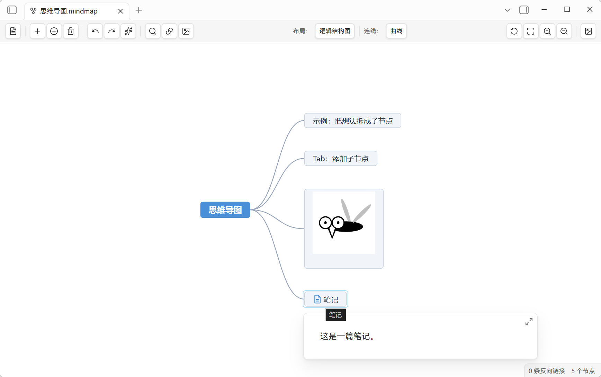

**[English](README.md) | 中文**

<div align="center">

# 🧠 MindMap Studio

> 在 Obsidian 中将 Markdown 渲染为思维导图。打开 `.mindmap.md` —— 一个普通的 Markdown 文件 —— 以思维导图编辑；Markdown 大纲可无损往返。基于 [simple-mind-map](https://github.com/wanglin2/mind-map) 引擎，由 [WinterMosquito](https://github.com/WinterMosquito) 开发。

<p align="center">
  
  
  
  
</p>

</div>

## 🚀 快速上手

1. **新建**：命令面板 / 丝带点「新建思维导图」→ 生成 `思维导图2026-09-06.mindmap.md` 并进入导图视图。
2. **编辑**：文件就是普通 Markdown，大纲即导图——增删改节点、拖拽排序、配置图片/链接。
3. **回写**：用「切换回 Markdown」随时切回；改动会写回文件（布局 / 视口记在插件 `data.json`）。

---



## ✨ 为什么用 MindMap Studio

插件是一个**渲染层**，而非格式转换器。`.mindmap.md` 是 100% 标准 Markdown —— 你的笔记、链接、反向链接、全文搜索与 Git 照常生效。插件把 Markdown 大纲解析为思维导图；你在导图中编辑后，改动会写回为 Markdown。

## 🚀 功能特性

- **纯 Markdown**：`.mindmap.md` 就是普通 Markdown（标题 + 列表），无专有格式。
- **往返保真**：未编辑的行逐字回写（frontmatter 原样保留）；标题 `#`–`######` 对应导图第 1–6 级节点，缩进列表对应更深层级。
- **Obsidian 原生双链**：`[[笔记]]` 显示为链接文本，支持悬停预览与 `Ctrl+点击`（Windows/Linux）或 `Command+点击`（macOS）跳转；「添加链接」联想笔记与可链接附件。新增链接一律写为 `[[双链]]`（不跟随 Obsidian 的链接格式设置），以保证文档链接使用专属图标。**节点内只显示别名**（无别名时为笔记名）；纯双链节点里编辑节点文本即等于改别名，保存后回写为 `[[笔记|新别名]]`。把仓库内笔记/附件拖到节点上、或在「添加链接」中选中双链，**节点文字即被链接显示名覆盖**、成为纯双链节点；URL 链接仍保持仅图标。
- **图片**：仓库内图片联想、统一尺寸、`![[路径]]` 往返；拖动右下角手柄即可调整节点图片大小，尺寸以 Obsidian 官方嵌入语法写回笔记（`![[图.png|300]]` 仅宽等比、`|300x150` 指定宽高、`` 外链图）；清空文本后节点被图片独占——该节点已无文本，故节点搜索不会命中它。**段落（文本）节点行内的图片同样会渲染**（取首行；段落里的链接仍是纯文本）。
- **打开即 100%** 且整图居中；需要全览时点「适应画布」，点「重置缩放」回到 100%（屏幕上可见的内容保持原位；自动整理后自动适应画布）；**六种布局**（切换布局后自动整理并适应画布）+ 连线样式可切换（**自动**＝随布局，另可选曲线/直连/折线；按文件记忆；目录组织图/时间轴/鱼骨图为固定直线，下拉显示「自动」）、节点搜索、自动整理、大图性能模式、PNG 导出；**拖拽换父辅助**——拖到节点中心附近即挂为其子节点，拖到两兄弟之间即插入其间（实时高亮落点）。
- **状态持久化**：每个文件的布局、视口与「打开方式」偏好会保存（插件 data.json），重开/改名/切换视图后保持。
- **中心节点 ⇄ 文件名**：修改中心节点会自动重命名 `.mindmap.md` 文件（Obsidian 原生更新链接/反链）。

## 📖 使用说明

### ① 新建 / 打开
- 命令面板或丝带点 **「新建思维导图」** → 生成 `思维导图2026-09-06.mindmap.md` 并进入导图视图。
- 任意 `.mindmap.md` 文件：右键 → **「以思维导图打开」**（或同一命令）。你选择的视图会被记住。

### ② Markdown 如何变成导图
每个 `.mindmap.md` 都是 100% 标准 Markdown——插件只负责把它渲染成导图，并把你的编辑写回：

```markdown
# 项目计划                  ← 中心节点（= 文件名）
## 目标                     ← 一级子节点（#）
- 里程碑一                  ← 子节点（列表）
- 里程碑二
###### 细则                ← 6 级标题
- 第 7 级列表项              ← 标题下的列表缩进 → 第 7 级
```

> `#`–`######` → 第 1–6 级节点 · 嵌套列表更深层级 · `[[笔记]]` / `[[笔记|别名]]` → 可点链接（节点内只显示别名）· `![[图片]]` → 图片（`|300` 设置尺寸）· 段落与代码围栏保留为文本。
>
> 非图片嵌入（如 `![[报告.pdf]]`）显示为**附件图标**：点图标、或 `Ctrl`/`Command`+点击节点即可打开（PDF / 音频 / 视频），悬停节点同样触发 Obsidian 原生预览；不会在节点内内嵌渲染——导图节点无法承载 Obsidian 的媒体内嵌视图。

### ③ 常用操作（导图视图内）
| 想做什么 | 怎么做 |
|---|---|
| 编辑节点文本 | 双击节点（或按 **F2**；输入框内 F2 不接管）。节点是**纯双链**时，改的就是**别名** —— 保存后写回 `[[笔记\|新别名]]`，节点内仍只显示别名 |
| 添加子节点 / 同级节点 | 右键节点 → **添加子节点 / 添加同级节点**（同级也可按 Enter） |
| 删除节点 | 右键 → **删除节点** |
| 添加链接 | 选中节点 → 工具栏/菜单 **添加链接**（选笔记或粘贴 URL）。双链会以显示名覆盖节点文字（纯双链节点）；URL 保持仅图标 |
| 添加图片 | 选中节点 → **添加图片**（从仓库、剪贴板或文件） |
| 拖拽挂链接 | 从文件列表把笔记/附件拖到选中节点上——节点即挂上该双链，文字变为显示名（拖图片＝设为节点图片）；未选中节点时在根节点下新建链接节点（图片需先选中节点） |
| 调整布局 | 拖到目标节点中心附近=挂为其子；拖到两兄弟之间=插入其间（落点实时高亮） |
| 调整节点图片大小 | 悬停图片，拖动右下角手柄（等比缩放） |
| 图片独占节点 | 清空节点文本：双击清空，或右键 → **移除文本** |
| 排版 | 工具栏：**自动整理**、**重置缩放（100%）**、**适应画布**、放大/缩小 |
| 查找节点 | 工具栏搜索框 |
| 拆分节点内双链 | 选中节点 → 命令 **拆分节点内双链为子节点**：与描述文字混排的文档/附件双链移入子节点（节点保留文字；图片与外链不动）。编辑这类节点后同样会自动拆分，可在设置中关闭；命令 **拆分文档内全部混排双链** 可批量处理整篇（含未编辑的存量节点） |
| 导出 | 工具栏 **导出 PNG** |
| 返回 Markdown | **「切换回 Markdown」**（恢复进入前模式） |

### ④ 保存与持久化
- 未编辑的行**逐字回写**（frontmatter 原样保留）；**纯双链节点**（整行只有一个双链）的编辑即**改别名**，回写为 `[[笔记|新别名]]`（清空文本 = 去掉别名，链接保留；文本与链接共存的节点仍按「文本 + 链接」回写）。
- 布局、视口与「打开方式」按文件记在插件 `data.json`；节点图片尺寸则以官方嵌入语法（`![[图|300]]`）写入笔记本体。
- 编辑**中心节点**会自动重命名 `.mindmap.md`（Obsidian 原生更新链接/反链）。
- 配置仅存本地，无遥测。

完整的 Markdown ↔ 思维导图映射规则见 [`docs/markdown-mindmap-standard.md`](docs/markdown-mindmap-standard.md)。

## 📦 安装

- **社区插件**（上架后）：**设置 → 第三方插件** → 搜索 *MindMap Studio*。
- **从 GitHub Release 安装（推荐）**：从仓库 [Releases](https://github.com/WinterMosquito/Obsidian-Mindmap-Studio/releases) 页面下载最新版本的附件（`main.js`、`manifest.json`、`styles.css`），复制到 `<仓库>/.obsidian/plugins/mindmap-studio/`，重启 Obsidian 后在 **设置 → 第三方插件** 启用。
- **从源码构建**：`npm install && npm run build` 生成 `main.js`，与 `manifest.json`、`styles.css` 一起放入插件目录。

> 需要 Obsidian 1.13.0 或更高版本，仅支持桌面端（Windows / macOS / Linux）。配置仅存本地（插件 `data.json`），无遥测。`main.js` 由 CI 构建并随每个 GitHub Release 发布（不提交进仓库）。

## 🛠 开发

```bash
npm install
npm run dev      # watch 模式
npm run build    # 类型检查 + 生产构建（main.js）
npm test         # 回归测试（vitest）
npm run lint
```

引擎（`vendor/simple-mind-map.cjs`）为 vendor 产物，请勿手工编辑；升级时从上游源码重新打包替换。打包内含的第三方许可见 [`vendor/THIRD-PARTY-NOTICES.md`](vendor/THIRD-PARTY-NOTICES.md)。

## ⚖️ 许可证

MIT —— 见仓库根目录 `LICENSE` 文件。
